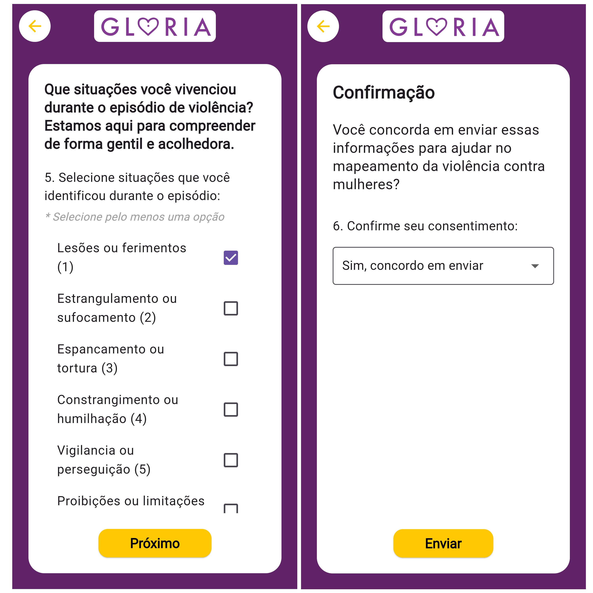
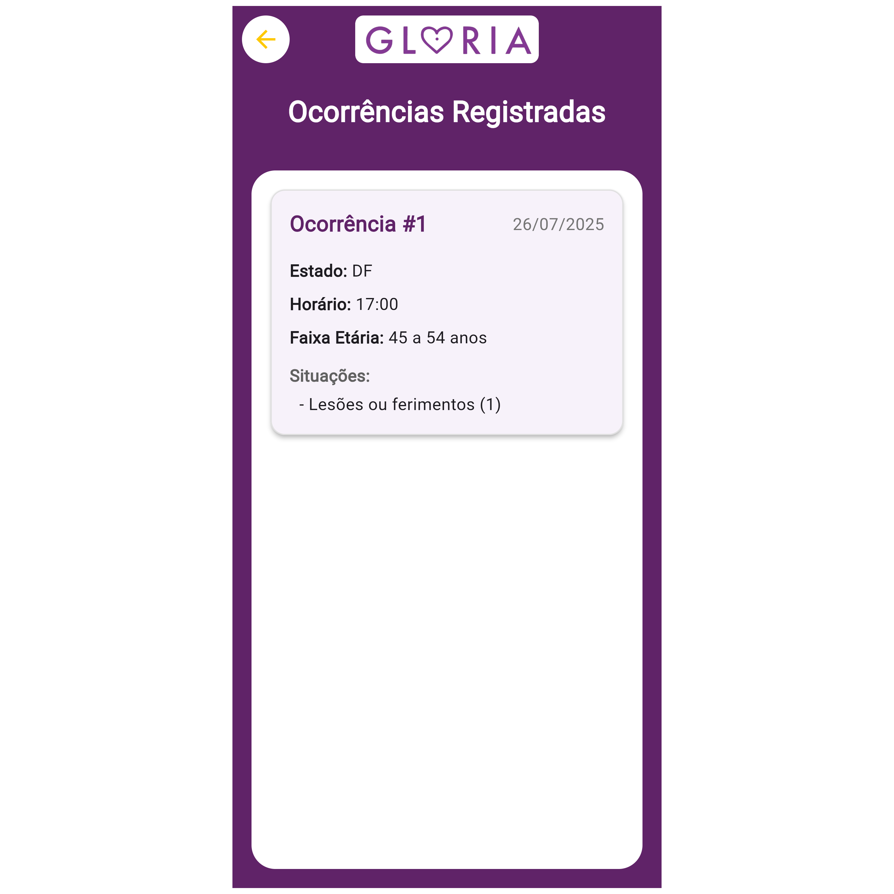

# 📱 Gloria App

Aplicativo mobile desenvolvido em Flutter com armazenamento local via Hive.  
Este projeto faz parte da iniciativa [Gloria](https://eusouagloria.com.br/home), uma plataforma voltada ao enfrentamento da violência contra a mulher.

## 🤝 Colaboração

Este é um projeto colaborativo desenvolvido por [@marcelagianini](https://github.com/marcelagianini) em parceria com [@barbarabea](https://github.com/barbarabea).

## 🧩 Tecnologias utilizadas

- **Flutter** (framework de desenvolvimento mobile)
- **Hive** (banco de dados local leve e eficiente)
- **Dart** (linguagem principal do Flutter)

## ✨ Funcionalidades atuais

- 📝 **Formulários interativos** com validação: os campos obrigatórios devem ser preenchidos antes de prosseguir (validação de entrada implementada).
- 🗺️ **Visualização de mapa (temporária)**: atualmente, o botão "Visualizar Mapa" mostra uma visualização estática das ocorrências registradas.
  > ⚠️ A equipe está trabalhando para implementar um **mapa interativo com geolocalização** em breve.

## 🖼️ Tela inicial

## 🖼️ Formulários-1

## 🖼️ Formulários-2

## 🖼️ Lista de ocorrências registradas

## Futuras implementações

- Integração com APIs externas
- Mapa interativo com exibição em tempo real das ocorrências
- Melhorias na navegação e experiência do usuário
